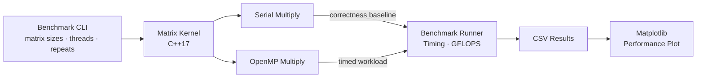

# Celia

Celia is a C++ and OpenMP tool that measures and visualizes multi-threaded CPU performance using parallel matrix math.

It multiplies dense matrices with a naive triple-loop kernel, parallelizes the outer loop with OpenMP, and sweeps matrix size and thread count to see how larger workloads benefit from additional threads. Results are written to CSV and plotted with Matplotlib.

## Tech stack

### Core stack
- C++17 (matrix computation and benchmark logic)
- OpenMP (multi-threaded parallelism)
- CMake (build system)
- High-resolution timing + GFLOPS (performance benchmarking)
- CSV (benchmark results)
- Python + Matplotlib (performance visualization)

### Benchmark design
- **Workload:** dense matrix multiplication
- **Correctness:** serial vs. parallel result validation
- **CLI:** configurable matrix sizes, thread counts, repeats, and output path
- **Analysis:** execution time, thread scaling, and parallelism crossover points

### System architecture



## Build

Requires a C++17 compiler with OpenMP support and CMake 3.10+.

```bash
cmake -S . -B build -DCMAKE_BUILD_TYPE=Release
cmake --build build --config Release
```

This produces a `celia` binary in `build/` (`celia.exe` on Windows).

## Run a benchmark

```bash
./build/celia --sizes 256,512,768,1024 --threads 1,2,4,8 --repeats 3 --output results.csv
```

### Options

- `--sizes` — comma-separated `N` values for `N x N` matrices
- `--threads` — comma-separated OpenMP thread counts to compare
- `--repeats` — timed runs per configuration; the fastest run is kept
- `--output` — path to the output CSV (`matrix_size,threads,seconds,gflops`)

Before timing the benchmark, Celia cross-checks a small parallel matrix multiplication against the serial implementation and warns if the results disagree.

### Example output

```text
matrix_size,threads,seconds,gflops
256,1,0.006,5.59
256,2,0.003,11.18
256,4,0.001,33.55
512,1,0.048,5.59
512,2,0.027,9.94
512,4,0.014,19.17
```

## Plot the results

Install the visualization dependencies:

```bash
pip install -r scripts/requirements.txt
```

Generate a performance plot:

```bash
python scripts/plot_results.py results.csv -o results.png
```

The resulting chart plots execution time against matrix size with a separate line for each thread count, making it easier to see where the overhead of parallelism is outweighed by the performance gained from additional threads.

## Project layout

```text
Celia/
├── CMakeLists.txt
├── src/
│   ├── matrix.hpp
│   ├── matrix.cpp
│   └── main.cpp
└── scripts/
    ├── plot_results.py
    └── requirements.txt
```

- `matrix.hpp` / `matrix.cpp` — matrix representation and serial/OpenMP multiplication
- `main.cpp` — benchmark CLI, timing, validation, and CSV output
- `plot_results.py` — converts benchmark CSV results into a Matplotlib performance chart
